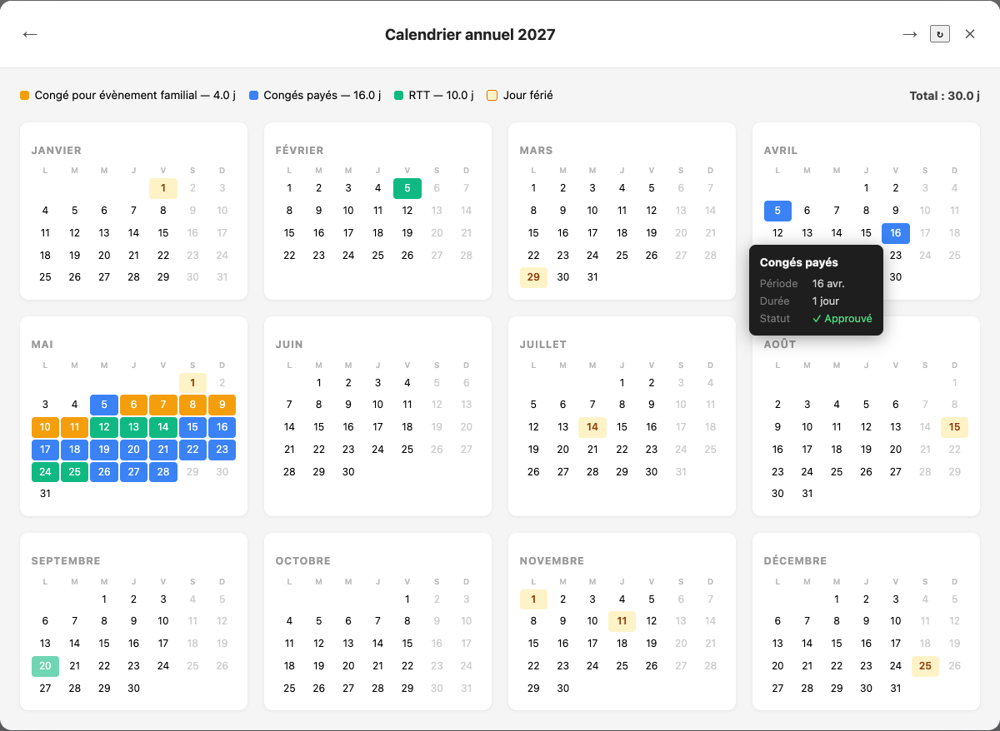

# Rippling Annual Calendar

Userscript that adds a yearly leave calendar to [Rippling](https://app.rippling.com). Rippling only shows time off month by month; this view shows the full year at once, with:

- every approved and pending leave, colored by policy
- public holidays from your holiday calendar
- per-policy and total day counts
- tooltips with period, duration, reason and status
- year navigation (buttons or arrow keys)

Screenshot from the offline demo, with anonymized data.

The script runs in your browser only. It reads your own data through the same API the Rippling web app uses, with your current session. Nothing is sent anywhere else.

## Install

1. Install a userscript manager: [Violentmonkey](https://violentmonkey.github.io/) (Firefox) or [Orangemonkey](https://chromewebstore.google.com/detail/orangemonkey/ekmeppjgajofkpiofbebgcbohbmfldaf) (Chrome).
2. Open **[rippling-annual-calendar.user.js](https://github.com/remiflament/rippling-annual-calendar/releases/latest/download/rippling-annual-calendar.user.js)** and confirm the install.

Updates are automatic. Details and troubleshooting: [docs/installation.md](docs/installation.md).

## Usage

Open the Time Off page on [app.rippling.com](https://app.rippling.com/time-products). Click **Calendrier annuel** at the bottom right.

## Limitations

Rippling has no public API for this data. The script relies on reverse-engineered endpoints that can change without notice. Known gaps are listed in [docs/api/](docs/api/README.md).

## Development

See [docs/development.md](docs/development.md). API research and live checks: [docs/reverse-engineering.md](docs/reverse-engineering.md).

## License

[MIT](LICENSE)
